# 🧠 DL Mental Health Classification

## Abstract
Mental health has always been an important matter for the well-being of people of different ages, especially adolescents as the next working force for different societies, it affects their behaviour, connections with other people, personal life matters, and their work. Furthermore, it is crucial to maintain mental wellness by identifying mental disorders early and taking measures against them. AI and technological advancements play an important role in assisting individuals with mental disorders and aiding mental health professionals with the diagnosis process. Several individuals do not wish to interact with a mental health professional for either financial or personal reasons, that is when the use of deep learning to develop a model that can help some individuals get insights on chances for having one or several mental disorders, which could be particularly useful for adolescents and mental health professionals to help make the diagnosis process easier for both parties.

## A beginner-friendly deep learning project focused on **mental health classification**.
Whether you're just getting started with AI or looking to understand how deep learning can be applied to real-world problems, this project will help you understand how to prepare data, preprocess data, create and train a DL model. 
Below is how the project was approached:

### - **Exploratory Data Analysis**
  > This would include a Jupyter Notebook file that i made quickly to explain a couple of things for those who are interested:
  >
  >  - Dataset https://www.kaggle.com/datasets/kamaruladha/mental-disorders-identification-reddit-nlp
  > - dataAnalysis.ipynb
  >

​	Below are some screenshots displaying two sets of the data, one i called "raw" which is the original dataset from reddit the 2nd is 	my own cleaned version of the dataset which i used mainly during this project, i would highly recommend you download the original 	from the Kaggle link provided above, if for any reason the dataset is not available there i can look to upload it but keep an eye on 	the Kaggle link as it may receive updates.

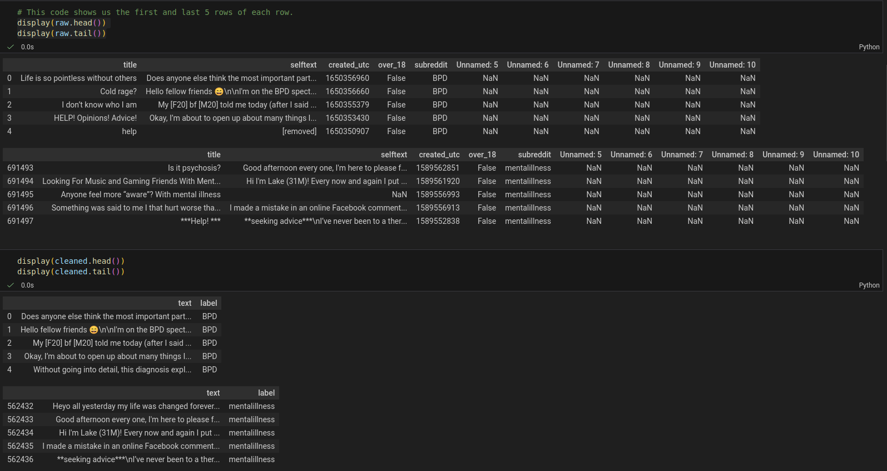

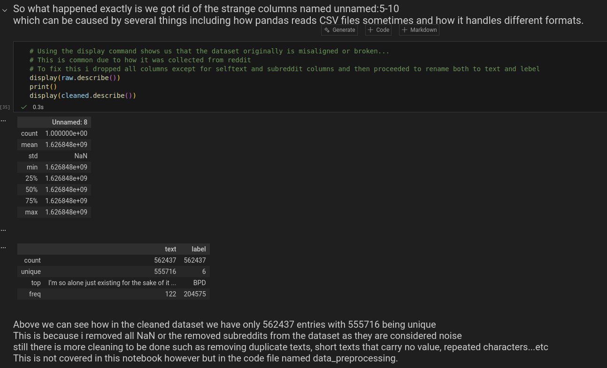

​	from the above images we can imagine that there are mixed data types, which is bad for training AI and since we are training 	the models on text data we should be expecting strings as input (so Objects) so we check  the dtypes of both the cleaned and the	raw datasets. I was expecting created_utc to be of type float but it does not matter.

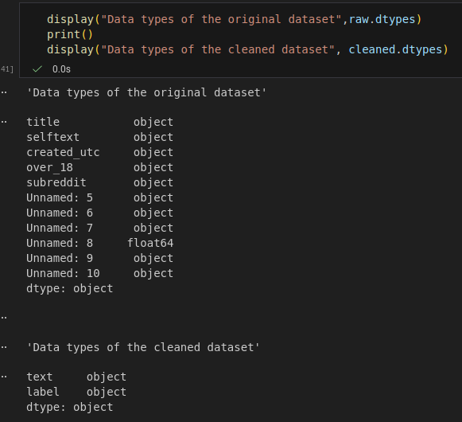

​	It is important to also view the values of all columns and their count since we want to determine if there will be a class imbalance	or not in our dataset, in this project i did not address class imbalance as both over and under-sampling resulted in negative out-	comes. There are of course other techniques to handle class imbalance in datasets like using different metrics (F1, and Precision 	and Recall perclass), Text Augmentation, class weighted loss and so much more. Let's look at the number of values we have per	class.

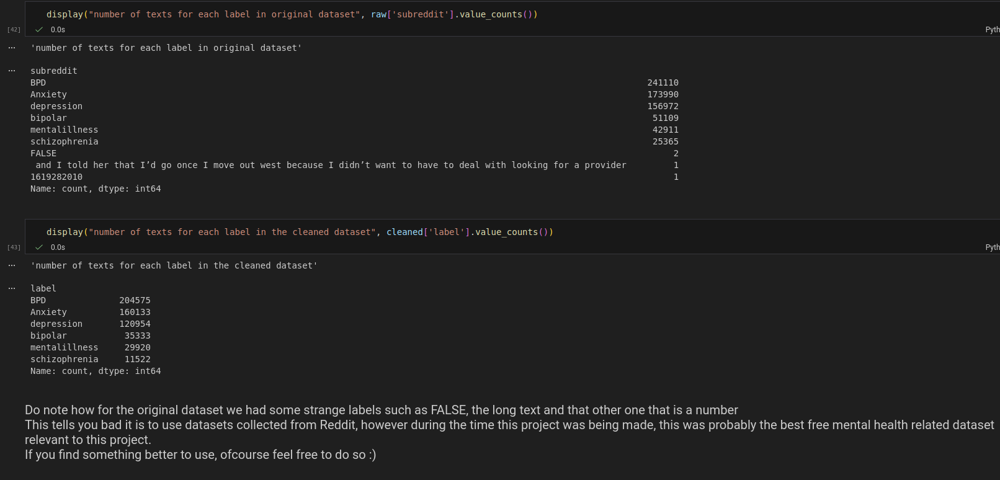

​	The class imbalance was rather drastic for oversampling as you will highly risk overfitting (one of the negative outcomes) and it 	appears using undersampling will result in a huge loss of meaningful data if done randomly, do note that it is also quite difficult to	determine which entries are valuable and which are not, so targeted undersampling would prove difficult and costly in terms of time

​	So I end up not addressing the class imbalance due to time constraint and hardware limitations (I considered using K-weighted 	Cross-Entropy at some point, check it out) and so I end up relying on different metrics to evaluate the models.

### - **Data Preprocessing**
  > This includes the following files in that order:
>  - data_preprocessing.py
>   - one_hot_labels.py
>   - train_fasttext.py
>   - generate_embeddings.py
>   - convert_TFRecord.py
>   - load_shuffle.py
>   - create_dataset.py

### - **Model Creation Training and Testing**
  > This includes creation_training.py

​	During this project i was considering a couple of approaches for the type of model we would train and how it would be trained. I had 	two choices:
- I can use an already pretrained strong transformer such as BERT, unfreeze some of its layers to use for our own dataset, and leave the rest unfrozen to leverage the only pretained embeddings of BERT as a large NLP model. (which was quite hardware constrained due to the size of our embeddings as well so it was neglected)
- I create a DNN from scratch using CNN, LSTM or a combination of both to make a model tailored specifically for our dataset and avoid any hardware limitations. (chosen path)

​	As a result i ended up with the below diagram

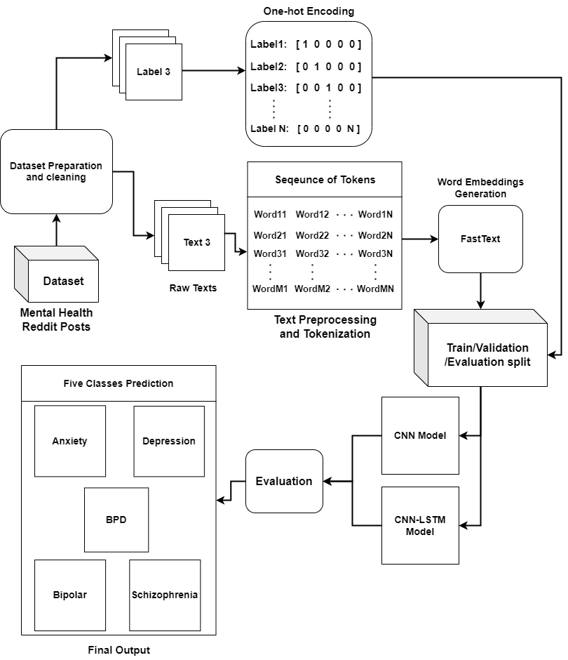

​	Later on i ended up with two models created and tested; a simple CNN based model and a hybrid CNN & Bi-LSTM model. The 	following images show a comparison between my two models and models from other studies and projects:

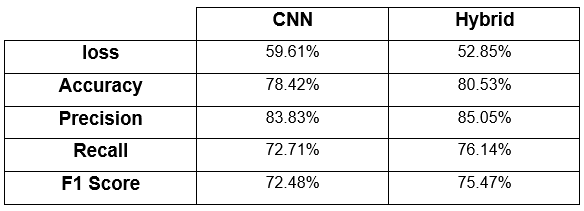

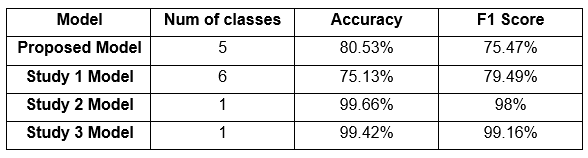

​	There is one thing i must note regarding these studies
- Study 1 proposed 6 models, one for each mental disorder in their dataset (classes). The results shown was for their worst class out of the 6, which was similar to schizophrenia for me with less samples than the rest of the classes
- Study 2 and 3 both proposed 1 model for only 1 mental disorder, while it is pointless comparing a binary classification with multiclass classification, I found it rather intriguing how my model was behind yet held a decent spot for the huge gap between the classes in my dataset.

​	Later after the project was finished and I had no more reason to work on it i managed to actually enhance it even more reaching 	the following results at some point, also i believe i was experimenting with BERT as i was trying integrate it with my model at some 	point.
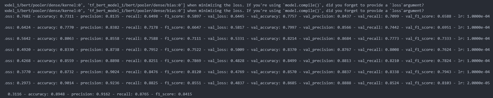

### - **Model evaluation**
  > This includes model_evaluation.py

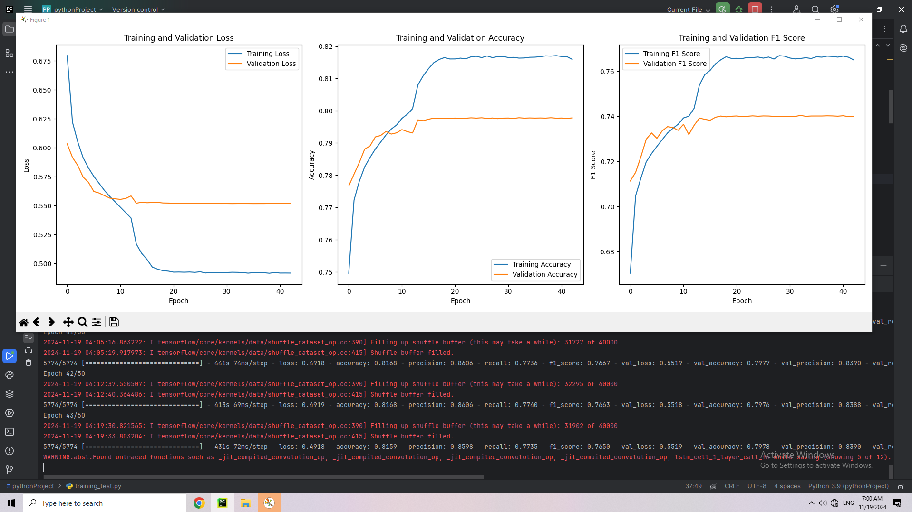

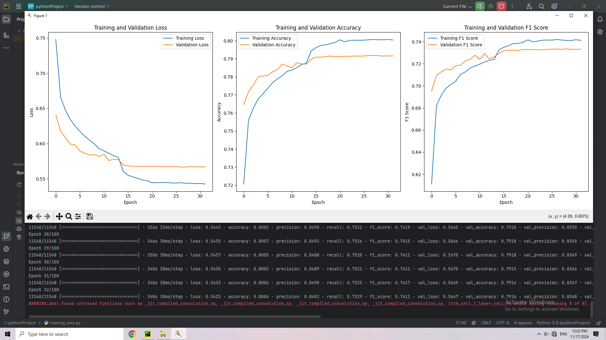

### The above two images are the last two tries to train and enhance the DNN of the CNN & Bi-LSTM model. The first image is the one before doing further tuning. Typically you want the two lines of training and validation metrics to be as close as possible, if they start close then start to have a gap that increases over the epochs, that is considering overfitting.

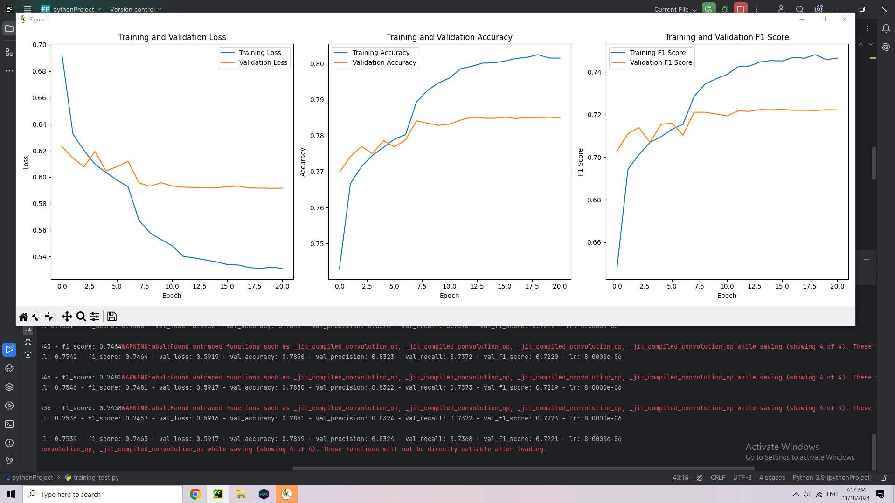

### The image above is the CNN model which i ditched as i knew CNNs alone would not be enough.
### Lastly an image of the model performing on the evaluation data subset.
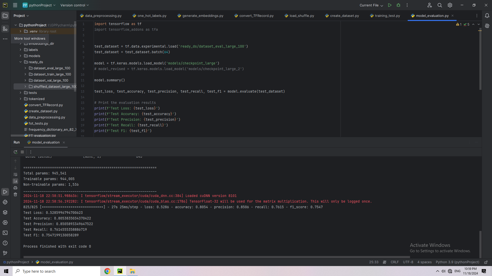

### - **Demonstration**
  > The purpose of this is to show a simple way to use the model created for classifiying the mental disorders:
>  - main_test.py
>  - application.py
# IMPORTANT NOTES!
  This project uses tensorflow keras framework. Please use requirements.txt to install the necessary libararies for the project to work as intended, the versions must be the same as the ones in the text file. 
  Also do note that to use the full dataset, same as i did, you will need an Nvidia gpu of 8gb VRAM as minimum, if you dont have a gpu with that much you wont able to fit the entire dataset into your gpu to proccess
  However you can always undersample the dataset. 
  my device's spec:

  - GPU: RTX 3050 8GB VRAM
  - CPU: R5 5600 6 cores/12 threads
  - 16gb DDR4 RAM 3600mhz 
One last important thing to note, you will need to go to https://www.tensorflow.org/install/source_windows#gpu and install the version of CUDA and CUDnn that is compatible with the tensorflow version in this project (i used TF 2.9 or 2.10)
